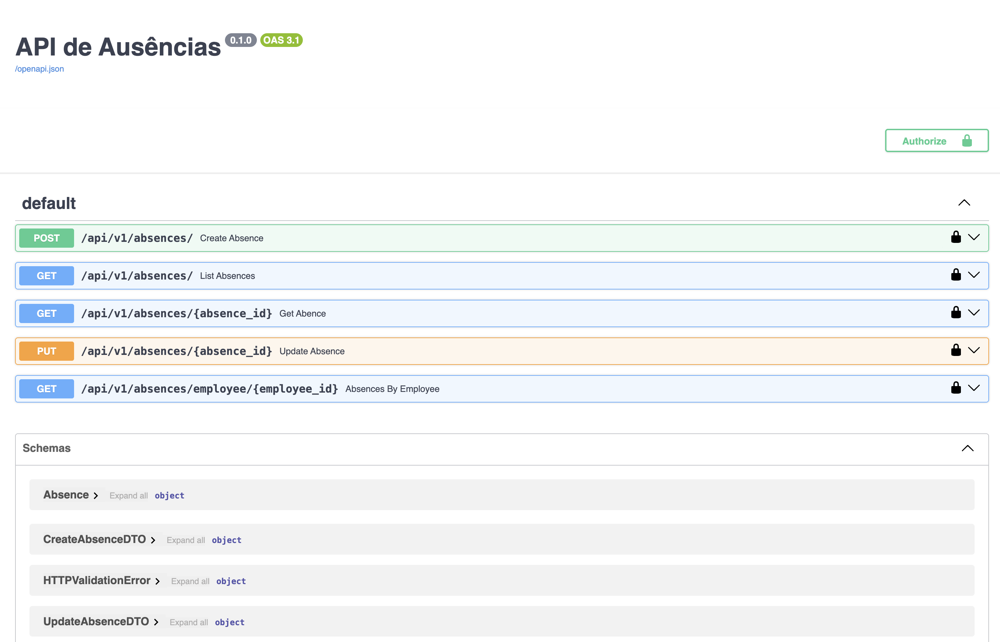

# API de Gestão de Ausências

Esta API permite gerenciar ausências de colaboradores, integrando **MongoDB** como banco de dados e **Keycloak** para autenticação.  
A API foi desenvolvida com **FastAPI** e utiliza **Motor** para acesso assíncrono ao MongoDB.

---

## 🧩 Tecnologias utilizadas

- Python 3.12
- FastAPI
- Pydantic
- Motor (MongoDB Async Driver)
- MongoDB 7
- Mongo Express (para administração do banco)
- Keycloak 26 (autenticação)
- Docker & Docker Compose

--- 

## Como rodar

```sh
    git clone https://github.com/acambinza/api-rest-python.git
    cd api-rest-python

    cp .env.example .env
    altera o .env

    docker-compose up -d --build
    docker-compose logs -f api

```
--- 

## Acessos

```sh

    API: http://localhost:8000/docs
    KEYCLOAK: http://localhost:8080

```

--- 

## Estrutura do Projeto

```sh

src/
├── domain/              # Entidades e regras de negócio
├── application/         # Use Cases / Services
├── infrastructure/      # Repositórios, MongoDB
├── presentation/        # Controllers, Routes, FastAPI
└── main.py / routes     # Inicialização da API

```

--- 
## Autour
- Anselmo Cambinza
- [LinkedId: /acambinza](https://www.linkedin.com/in/acambinza)